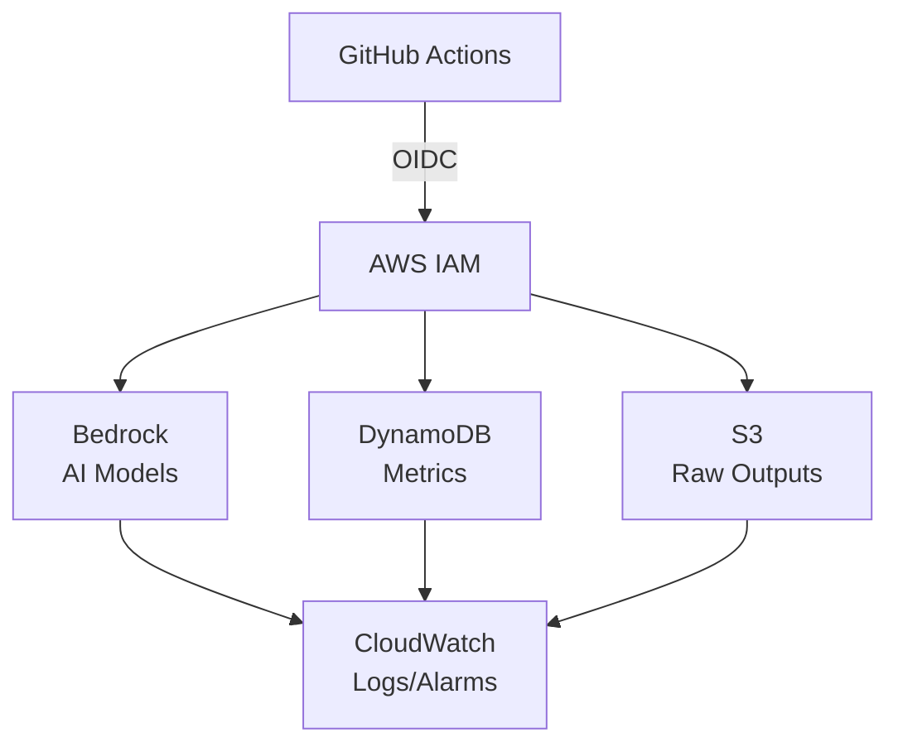

<!-- BEGIN_TF_DOCS -->
# Terraform-AWS-Quorum

Terraform module for Quorum AI code review infrastructure. OIDC federation, Bedrock access, DynamoDB metrics, S3 storage, CloudWatch observability - zero static credentials.

[](https://github.com/eze-godoy/terraform-aws-quorum/actions/workflows/terraform-ci.yml)
[](https://github.com/eze-godoy/terraform-aws-quorum/actions/workflows/release.yml)

## Features

- **OIDC Federation**: Secure GitHub Actions to AWS authentication without static credentials
- **IAM Role**: Least-privilege role scoped to specific repositories
- **Bedrock Access**: Pre-configured model access for AI code review
- **DynamoDB Metrics**: Single-table design for review metrics with TTL
- **S3 Storage**: Raw outputs with lifecycle policies (Standard → IA → Glacier)
- **CloudWatch**: Comprehensive logging, metrics, and alarms
- **Enterprise Ready**: VPC endpoints, KMS encryption, budget alerts

## Usage

```hcl
module "quorum" {
  source = "github.com/eze-godoy/terraform-aws-quorum?ref=v1.0.0"

  github_org   = "your-org"
  github_repos = ["repo1", "repo2"]  # Or use ["*"] for all repos

  environment = "prod"
}
```

### GitHub Actions Integration

```yaml
jobs:
  review:
    runs-on: ubuntu-latest
    permissions:
      id-token: write
      contents: read
    steps:
      - uses: aws-actions/configure-aws-credentials@v4
        with:
          role-to-assume: ${{ secrets.AWS_ROLE_ARN }}
          aws-region: us-east-1
```

## Requirements

| Name | Version |
|------|---------|
| <a name="requirement_terraform"></a> [terraform](#requirement\_terraform) | >= 1.0 |
| <a name="requirement_aws"></a> [aws](#requirement\_aws) | >= 6.0 |
| <a name="requirement_tls"></a> [tls](#requirement\_tls) | >= 4.0 |

## Providers

| Name | Version |
|------|---------|
| <a name="provider_aws"></a> [aws](#provider\_aws) | 6.25.0 |
| <a name="provider_tls"></a> [tls](#provider\_tls) | 4.1.0 |

## Resources

| Name | Type |
|------|------|
| [aws_iam_openid_connect_provider.github_actions](https://registry.terraform.io/providers/hashicorp/aws/latest/docs/resources/iam_openid_connect_provider) | resource |
| [aws_iam_role.github_actions](https://registry.terraform.io/providers/hashicorp/aws/latest/docs/resources/iam_role) | resource |
| [aws_iam_policy_document.github_actions_assume_role](https://registry.terraform.io/providers/hashicorp/aws/latest/docs/data-sources/iam_policy_document) | data source |
| [tls_certificate.github_actions](https://registry.terraform.io/providers/hashicorp/tls/latest/docs/data-sources/certificate) | data source |

## Inputs

| Name | Description | Type | Default | Required |
|------|-------------|------|---------|:--------:|
| <a name="input_github_org"></a> [github\_org](#input\_github\_org) | GitHub organization name for OIDC trust policy | `string` | n/a | yes |
| <a name="input_github_repos"></a> [github\_repos](#input\_github\_repos) | List of GitHub repository names for OIDC trust policy. Use ["*"] for all repos, or specify multiple repos like ["repo1", "repo2"] | `list(string)` | n/a | yes |
| <a name="input_environment"></a> [environment](#input\_environment) | Environment name for resource tagging | `string` | `"prod"` | no |
| <a name="input_tags"></a> [tags](#input\_tags) | Additional tags to apply to all resources | `map(string)` | `{}` | no |

## Outputs

| Name | Description |
|------|-------------|
| <a name="output_oidc_provider_arn"></a> [oidc\_provider\_arn](#output\_oidc\_provider\_arn) | ARN of the GitHub Actions OIDC identity provider |
| <a name="output_role_arn"></a> [role\_arn](#output\_role\_arn) | ARN of the IAM role for GitHub Actions to assume |
| <a name="output_role_name"></a> [role\_name](#output\_role\_name) | Name of the IAM role for GitHub Actions |

## Architecture



## Contributing

Contributions are welcome! Please read [CONTRIBUTING.md](CONTRIBUTING.md) for details on our development process and how to submit pull requests.

## License

This project is licensed under the MIT License - see the [LICENSE](LICENSE) file for details.

## Author

**Ezequiel Godoy** - [GitHub](https://github.com/eze-godoy) | [LinkedIn](https://www.linkedin.com/in/ezegodoy/) | [Web](https://ezegodoy.com)

---

Part of the [Quorum](https://github.com/eze-godoy/quorum-action) project - Multi-Model AI Code Review with Consensus Filtering.
<!-- END_TF_DOCS -->
