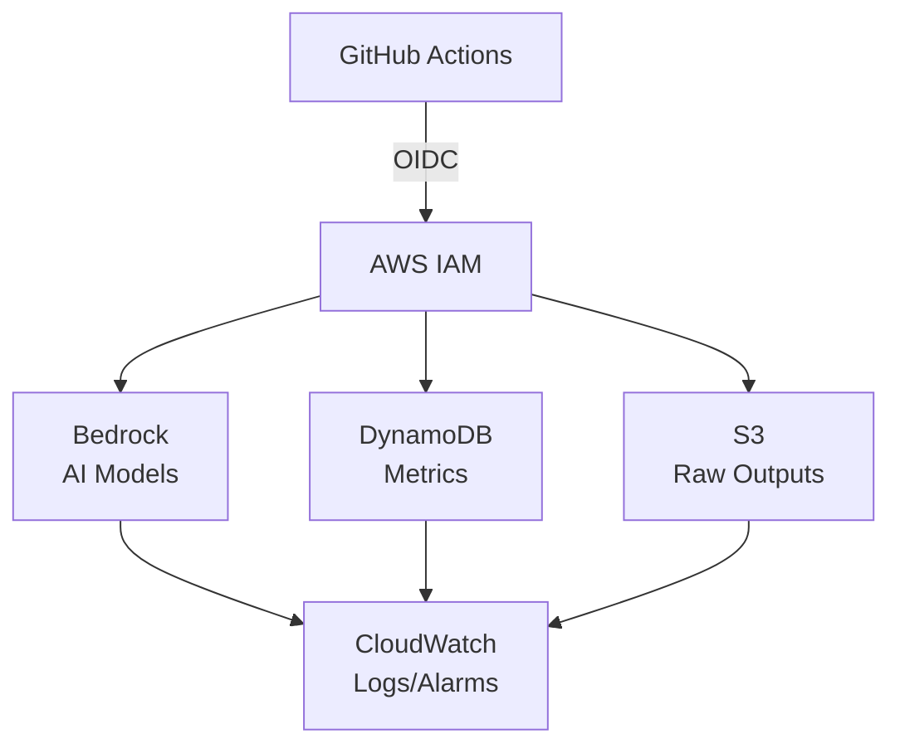

<!-- BEGIN_TF_DOCS -->
# Terraform-AWS-Quorum

Terraform module for Quorum AI code review infrastructure. OIDC federation, Bedrock access, DynamoDB metrics, S3 storage, CloudWatch observability - zero static credentials.

[](https://github.com/eze-godoy/terraform-aws-quorum/actions/workflows/terraform-ci.yml)
[](https://github.com/eze-godoy/terraform-aws-quorum/actions/workflows/release.yml)

## Features

- **OIDC Federation**: Secure GitHub Actions to AWS authentication without static credentials
- **IAM Role**: Least-privilege role scoped to specific repositories
- **Bedrock Access**: Pre-configured model access for AI code review
- **DynamoDB Metrics**: Single-table design for review metrics with TTL
- **S3 Storage**: Raw outputs with lifecycle policies (Standard → IA → Glacier)
- **CloudWatch**: Comprehensive logging, metrics, and alarms
- **Enterprise Ready**: VPC endpoints, KMS encryption, budget alerts

## Usage

```hcl
module "quorum" {
  source = "github.com/eze-godoy/terraform-aws-quorum?ref=v1.0.0"

  github_org   = "your-org"
  github_repos = ["repo1", "repo2"]  # Or use ["*"] for all repos

  environment = "prod"
}
```

### GitHub Actions Integration

```yaml
jobs:
  review:
    runs-on: ubuntu-latest
    permissions:
      id-token: write
      contents: read
    steps:
      - uses: aws-actions/configure-aws-credentials@v4
        with:
          role-to-assume: ${{ secrets.AWS_ROLE_ARN }}
          aws-region: us-east-1
```

## Requirements

| Name | Version |
|------|---------|
| <a name="requirement_terraform"></a> [terraform](#requirement\_terraform) | >= 1.0 |
| <a name="requirement_aws"></a> [aws](#requirement\_aws) | >= 6.0 |
| <a name="requirement_tls"></a> [tls](#requirement\_tls) | >= 4.0 |

## Providers

| Name | Version |
|------|---------|
| <a name="provider_aws"></a> [aws](#provider\_aws) | >= 6.0 |
| <a name="provider_tls"></a> [tls](#provider\_tls) | >= 4.0 |

## Resources

| Name | Type |
|------|------|
| [aws_bedrock_guardrail.quorum](https://registry.terraform.io/providers/hashicorp/aws/latest/docs/resources/bedrock_guardrail) | resource |
| [aws_dynamodb_table.quorum_metrics](https://registry.terraform.io/providers/hashicorp/aws/latest/docs/resources/dynamodb_table) | resource |
| [aws_iam_openid_connect_provider.github_actions](https://registry.terraform.io/providers/hashicorp/aws/latest/docs/resources/iam_openid_connect_provider) | resource |
| [aws_iam_policy.bedrock_access](https://registry.terraform.io/providers/hashicorp/aws/latest/docs/resources/iam_policy) | resource |
| [aws_iam_role.github_actions](https://registry.terraform.io/providers/hashicorp/aws/latest/docs/resources/iam_role) | resource |
| [aws_iam_role_policy_attachment.bedrock_access](https://registry.terraform.io/providers/hashicorp/aws/latest/docs/resources/iam_role_policy_attachment) | resource |
| [aws_kms_alias.quorum](https://registry.terraform.io/providers/hashicorp/aws/latest/docs/resources/kms_alias) | resource |
| [aws_kms_key.quorum](https://registry.terraform.io/providers/hashicorp/aws/latest/docs/resources/kms_key) | resource |
| [aws_s3_bucket.quorum_outputs](https://registry.terraform.io/providers/hashicorp/aws/latest/docs/resources/s3_bucket) | resource |
| [aws_s3_bucket_lifecycle_configuration.quorum_outputs](https://registry.terraform.io/providers/hashicorp/aws/latest/docs/resources/s3_bucket_lifecycle_configuration) | resource |
| [aws_s3_bucket_public_access_block.quorum_outputs](https://registry.terraform.io/providers/hashicorp/aws/latest/docs/resources/s3_bucket_public_access_block) | resource |
| [aws_s3_bucket_server_side_encryption_configuration.quorum_outputs](https://registry.terraform.io/providers/hashicorp/aws/latest/docs/resources/s3_bucket_server_side_encryption_configuration) | resource |
| [aws_s3_bucket_versioning.quorum_outputs](https://registry.terraform.io/providers/hashicorp/aws/latest/docs/resources/s3_bucket_versioning) | resource |
| [aws_caller_identity.current](https://registry.terraform.io/providers/hashicorp/aws/latest/docs/data-sources/caller_identity) | data source |
| [aws_iam_policy_document.bedrock_access](https://registry.terraform.io/providers/hashicorp/aws/latest/docs/data-sources/iam_policy_document) | data source |
| [aws_iam_policy_document.github_actions_assume_role](https://registry.terraform.io/providers/hashicorp/aws/latest/docs/data-sources/iam_policy_document) | data source |
| [aws_region.current](https://registry.terraform.io/providers/hashicorp/aws/latest/docs/data-sources/region) | data source |
| [tls_certificate.github_actions](https://registry.terraform.io/providers/hashicorp/tls/latest/docs/data-sources/certificate) | data source |

## Inputs

| Name | Description | Type | Default | Required |
|------|-------------|------|---------|:--------:|
| <a name="input_allowed_models"></a> [allowed\_models](#input\_allowed\_models) | List of Bedrock model IDs to allow access to. Run 'aws bedrock list-foundation-models' to see available models in your region. | `list(string)` | n/a | yes |
| <a name="input_github_org"></a> [github\_org](#input\_github\_org) | GitHub organization name for OIDC trust policy | `string` | n/a | yes |
| <a name="input_github_repos"></a> [github\_repos](#input\_github\_repos) | List of GitHub repository names for OIDC trust policy. Use ["*"] for all repos, or specify multiple repos like ["repo1", "repo2"] | `list(string)` | n/a | yes |
| <a name="input_s3_bucket_suffix"></a> [s3\_bucket\_suffix](#input\_s3\_bucket\_suffix) | Unique suffix for S3 bucket name (required for global uniqueness). Example: 'myorg-prod' results in 'quorum-outputs-myorg-prod' | `string` | n/a | yes |
| <a name="input_enable_bedrock_guardrails"></a> [enable\_bedrock\_guardrails](#input\_enable\_bedrock\_guardrails) | Enable Bedrock Guardrails for content filtering (enterprise feature) | `bool` | `false` | no |
| <a name="input_enable_kms_encryption"></a> [enable\_kms\_encryption](#input\_enable\_kms\_encryption) | Enable dedicated KMS key for DynamoDB and S3 encryption (if false, uses AWS managed keys) | `bool` | `true` | no |
| <a name="input_enable_point_in_time_recovery"></a> [enable\_point\_in\_time\_recovery](#input\_enable\_point\_in\_time\_recovery) | Enable DynamoDB point-in-time recovery for data protection | `bool` | `true` | no |
| <a name="input_environment"></a> [environment](#input\_environment) | Environment name for resource tagging | `string` | `"prod"` | no |
| <a name="input_guardrail_config"></a> [guardrail\_config](#input\_guardrail\_config) | Configuration for Bedrock Guardrails when enabled | <pre>object({<br/>    name                     = optional(string, "quorum-guardrail")<br/>    blocked_input_messaging  = optional(string, "Your input contains content that is not allowed.")<br/>    blocked_output_messaging = optional(string, "The model response was filtered due to content policy.")<br/>    content_filters_config = optional(list(object({<br/>      type            = string<br/>      input_strength  = string<br/>      output_strength = string<br/>    })), [])<br/>  })</pre> | `{}` | no |
| <a name="input_raw_outputs_retention_days"></a> [raw\_outputs\_retention\_days](#input\_raw\_outputs\_retention\_days) | Number of days before transitioning raw outputs from Standard to Standard-IA storage | `number` | `30` | no |
| <a name="input_tags"></a> [tags](#input\_tags) | Additional tags to apply to all resources | `map(string)` | `{}` | no |

## Outputs

| Name | Description |
|------|-------------|
| <a name="output_allowed_models"></a> [allowed\_models](#output\_allowed\_models) | List of Bedrock model IDs that the role has access to |
| <a name="output_bedrock_policy_arn"></a> [bedrock\_policy\_arn](#output\_bedrock\_policy\_arn) | ARN of the IAM policy for Bedrock access |
| <a name="output_dynamodb_table_arn"></a> [dynamodb\_table\_arn](#output\_dynamodb\_table\_arn) | ARN of the DynamoDB metrics table |
| <a name="output_dynamodb_table_name"></a> [dynamodb\_table\_name](#output\_dynamodb\_table\_name) | Name of the DynamoDB metrics table |
| <a name="output_guardrail_arn"></a> [guardrail\_arn](#output\_guardrail\_arn) | ARN of the Bedrock Guardrail (if enabled) |
| <a name="output_guardrail_id"></a> [guardrail\_id](#output\_guardrail\_id) | ID of the Bedrock Guardrail (if enabled) |
| <a name="output_guardrail_version"></a> [guardrail\_version](#output\_guardrail\_version) | Version of the Bedrock Guardrail (if enabled) |
| <a name="output_kms_key_arn"></a> [kms\_key\_arn](#output\_kms\_key\_arn) | ARN of the KMS key for storage encryption (if enabled) |
| <a name="output_kms_key_id"></a> [kms\_key\_id](#output\_kms\_key\_id) | ID of the KMS key for storage encryption (if enabled) |
| <a name="output_oidc_provider_arn"></a> [oidc\_provider\_arn](#output\_oidc\_provider\_arn) | ARN of the GitHub Actions OIDC identity provider |
| <a name="output_role_arn"></a> [role\_arn](#output\_role\_arn) | ARN of the IAM role for GitHub Actions to assume |
| <a name="output_role_name"></a> [role\_name](#output\_role\_name) | Name of the IAM role for GitHub Actions |
| <a name="output_s3_bucket_arn"></a> [s3\_bucket\_arn](#output\_s3\_bucket\_arn) | ARN of the S3 bucket for raw model outputs |
| <a name="output_s3_bucket_name"></a> [s3\_bucket\_name](#output\_s3\_bucket\_name) | Name of the S3 bucket for raw model outputs |

## Architecture



## Contributing

Contributions are welcome! Please read [CONTRIBUTING.md](CONTRIBUTING.md) for details on our development process and how to submit pull requests.

## License

This project is licensed under the MIT License - see the [LICENSE](LICENSE) file for details.

## Author

**Ezequiel Godoy** - [GitHub](https://github.com/eze-godoy) | [LinkedIn](https://www.linkedin.com/in/ezegodoy/) | [Web](https://ezegodoy.com)

---

Part of the [Quorum](https://github.com/eze-godoy/quorum-action) project - Multi-Model AI Code Review with Consensus Filtering.
<!-- END_TF_DOCS -->
