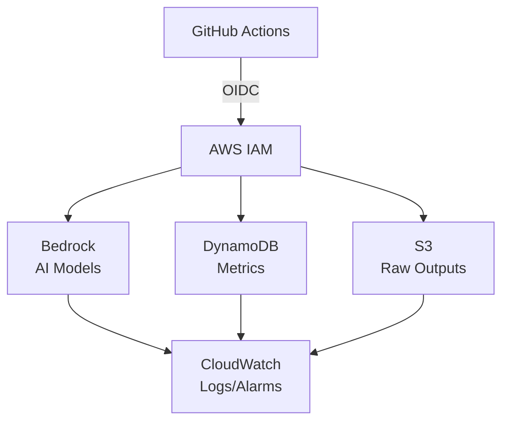

## Architecture

## Contributing

Contributions are welcome! Please read [CONTRIBUTING.md](CONTRIBUTING.md) for details on our development process and how to submit pull requests.

## License

This project is licensed under the MIT License - see the [LICENSE](LICENSE) file for details.

## Author

**Ezequiel Godoy** - [GitHub](https://github.com/eze-godoy) | [LinkedIn](https://www.linkedin.com/in/ezegodoy/)

---

Part of the [Quorum](https://github.com/eze-godoy/quorum-action) project - Multi-Model AI Code Review with Consensus Filtering.
